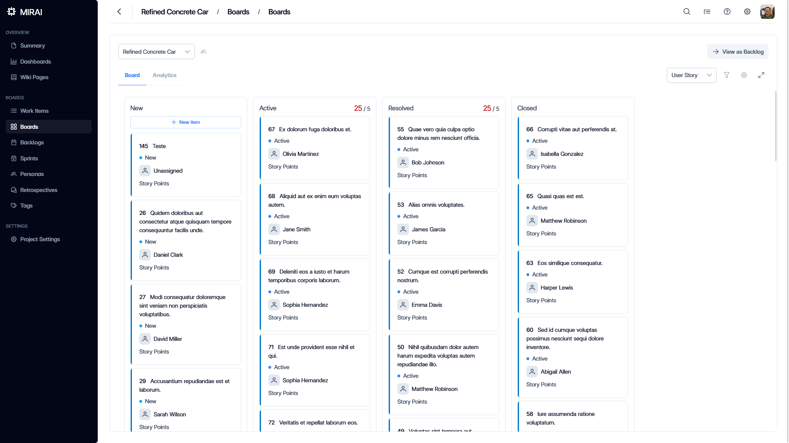

# Mirai

Mirai (Japanese word for "future") is a web-based project management tool that aims to help teams collaborate and manage their projects more effectively.

Key features include:

- [Agile and Scrum](http://docs.miraihq.com/agile-and-scrum)
- [Wikis](http://docs.miraihq.com/wikis)
- [Wisdom Extractor](http://docs.miraihq.com/wisdom-extractor)

## Documentation

Explore our comprehensive [documentation](http://docs.miraihq.com) to help you get started with Mirai.

## License

This project is licensed under the terms of the GNU General Public License v3.0. See the [LICENSE](LICENSE) file for details.
